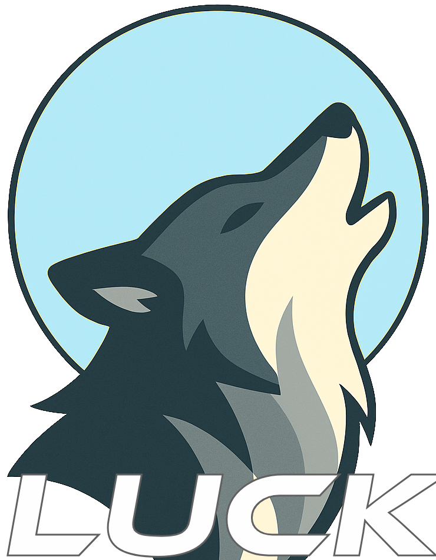

# LUCK

'Luck' was the name of my beloved pet, a Siberian wolf-dog who is no longer with me.  
This application is a heartfelt tribute to him, reflecting the joy, loyalty, and energy he brought into my life.

---

## About

LUCK is an open-source application built with PyQt6 and released under the GNU General Public License v3.  
The project is free to use, modify, and distribute, as long as it complies with the GPLv3 terms.

---

## License

This project is licensed under the **GNU GPLv3**.  
See the [LICENSE](LICENSE) file for the full license text.

---

## Trademark Policy

The name **LUCK** and its logo are protected trademarks of the author.  

- You **must not** change the original name or logo of the application.  
- Derivative distributions may keep the original name "LUCK" unchanged,  
  or optionally add an identifier in the following format:  

LUCK <Dog_Breed>

Examples: `LUCK Husky`, `LUCK German Shepherd`, `LUCK Dingo`.

- The original logo must remain unchanged.  

See the [TRADEMARK.md](TRADEMARK.md) file for more details.

---

## Contributing

Contributions are welcome!  
Please note that while the source code follows GPLv3, any use of the **LUCK** name or logo must respect the trademark policy.

---

## Contact

For questions, feedback, or contributions:  
- GitHub: [Julian D. Londoño H](https://github.com/jlondohi/Luck)

---

## Attribution

This project uses icons from [Flaticon](https://www.flaticon.com) under the **Free License with Attribution**.  
Credits to the original authors:

- Freepik  
- Pixel perfect  
- Slidicon  
- Cap Cool  
- Phoenix Dungeon  
- desiner11  

Full license details at [Flaticon Terms of Use](https://www.flaticon.com/terms-of-use).

---

## Author

Copyright © 2024  
**Julian D. Londoño H.**  
Released under the GNU GPLv3